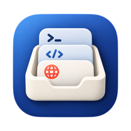

# Noaam

**Not Another Agent Manager.** Tired of agent managers? Me too. Noaam doesn't
replace your tools or wrap your agents. It keeps track of the coding agents,
editors, terminals and pages you already use, filed under the repo, worktree
or folder they belong to.

Free for macOS 14 or later (Apple silicon).

- [Website](https://noaam.dev/)
- [Download the latest release](https://github.com/conformal-link/noaam-site/releases/latest/download/Noaam.dmg)
- [Guide](https://noaam.dev/docs/)
- [How status works](https://noaam.dev/docs/status.html)
- [Sponsor](https://github.com/sponsors/conformal-link) if it saves you time

This repository holds the website and the releases. Feedback, ideas and bug
reports go to [Discussions](https://github.com/conformal-link/noaam-site/discussions).
